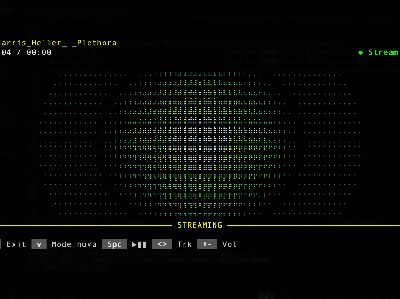
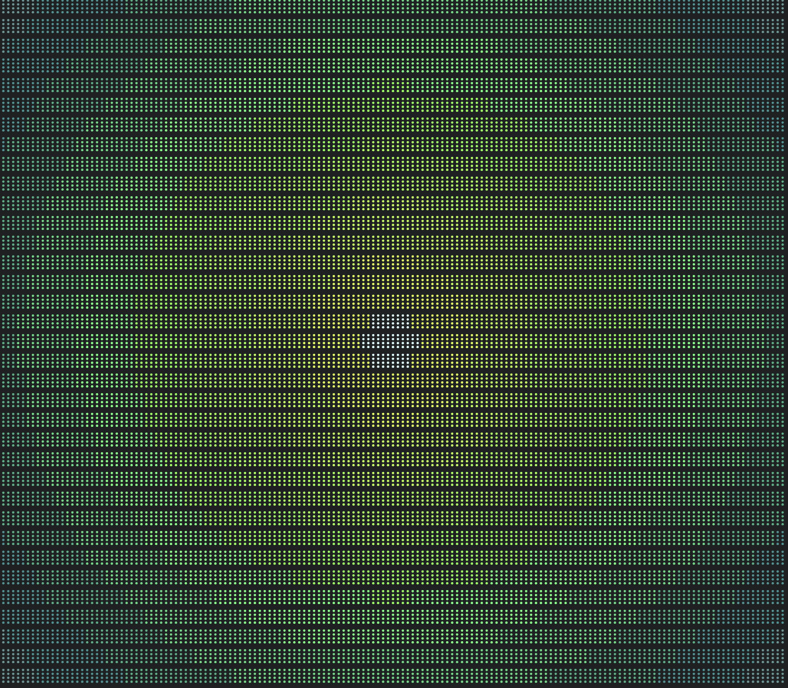
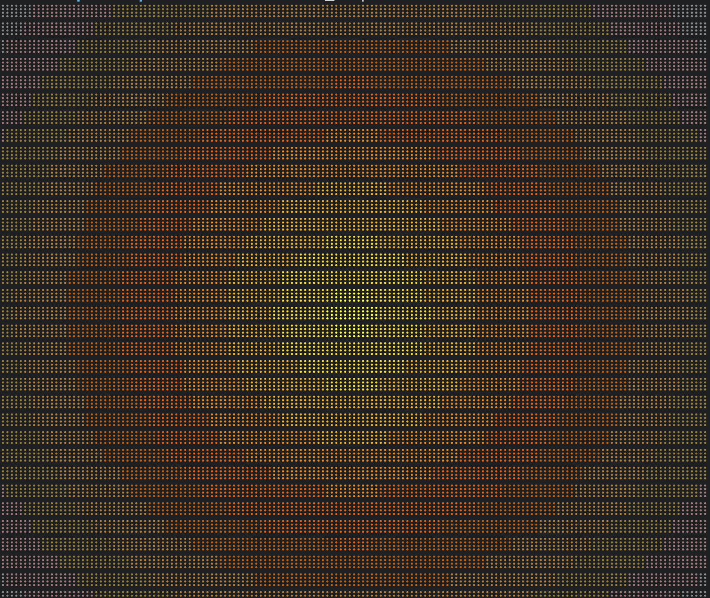
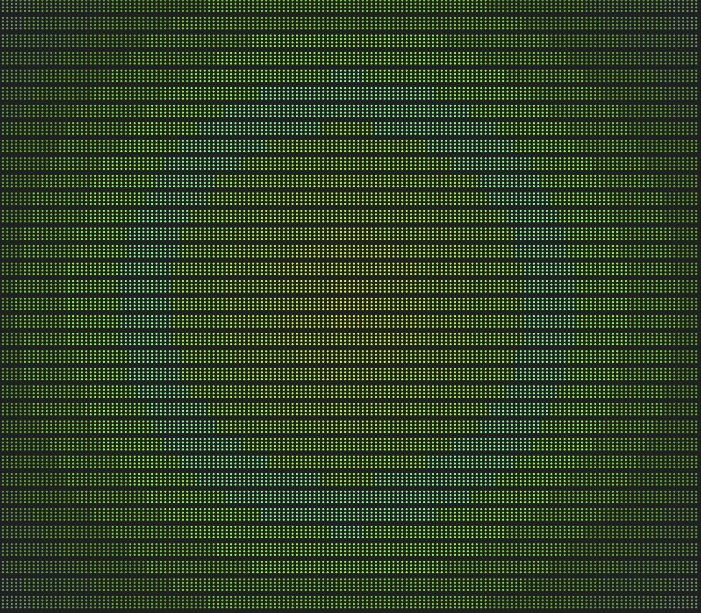
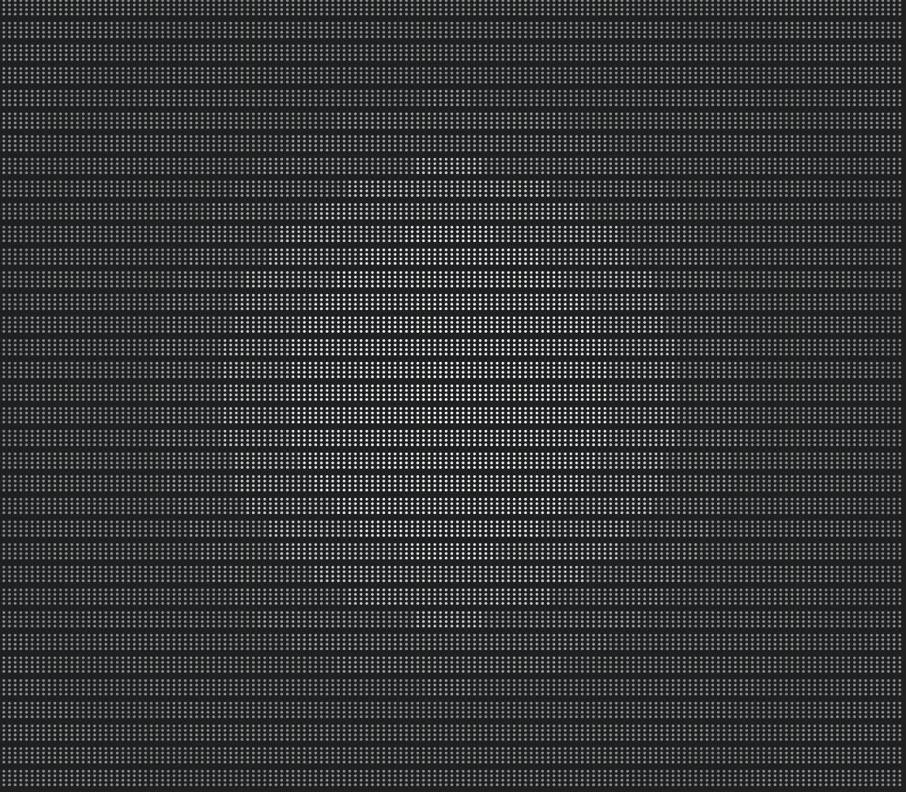
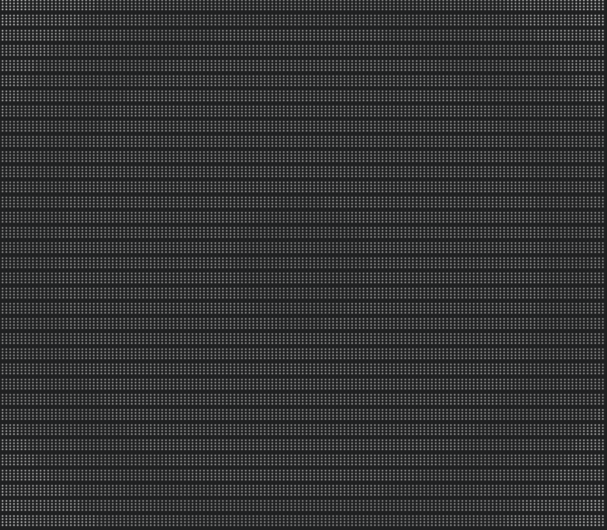
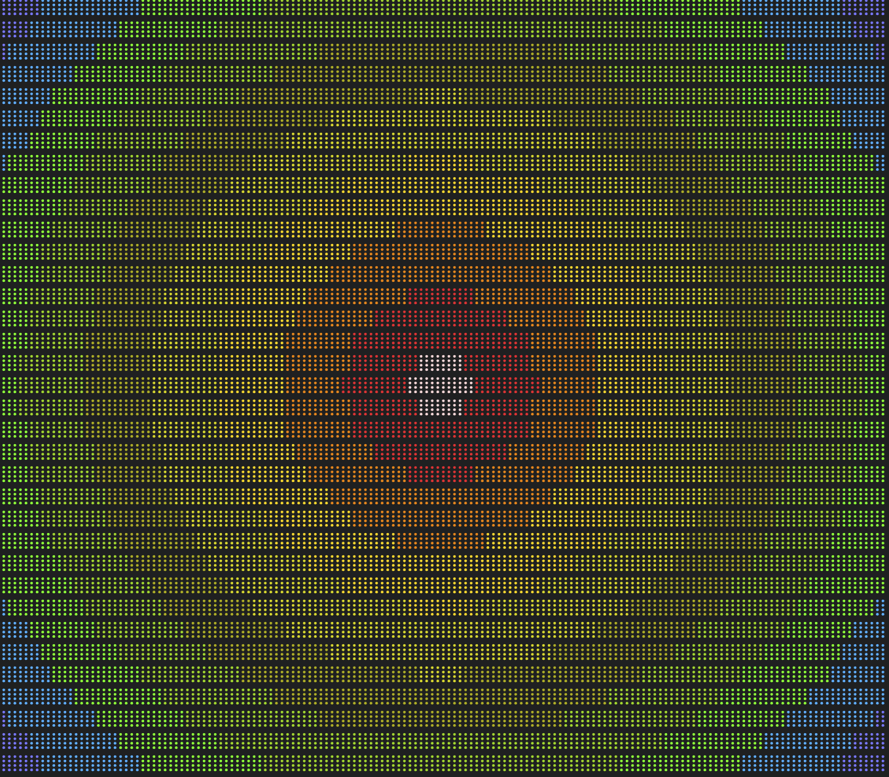
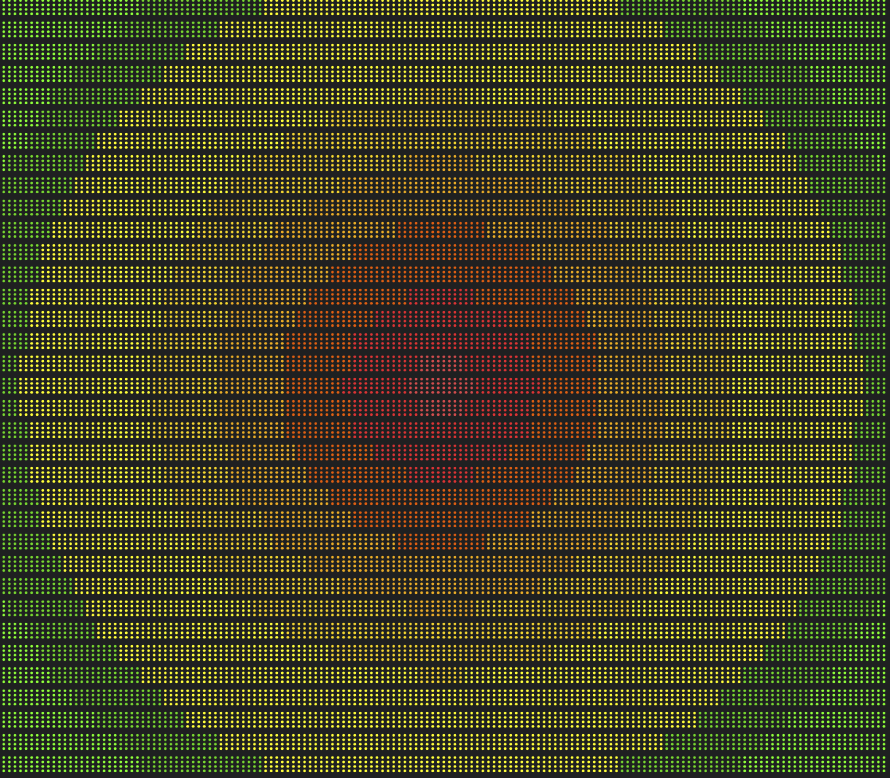
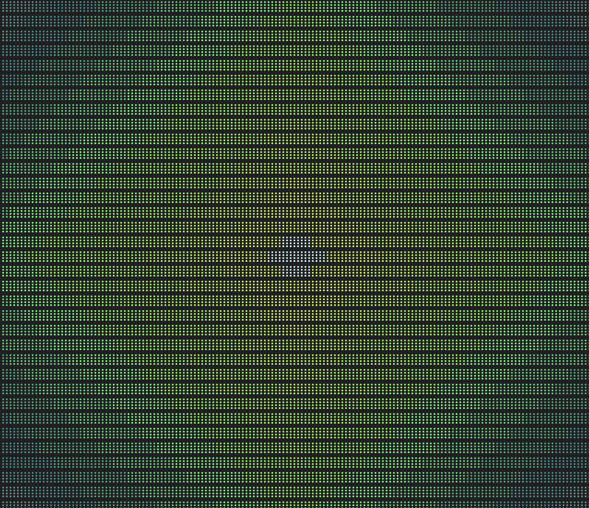
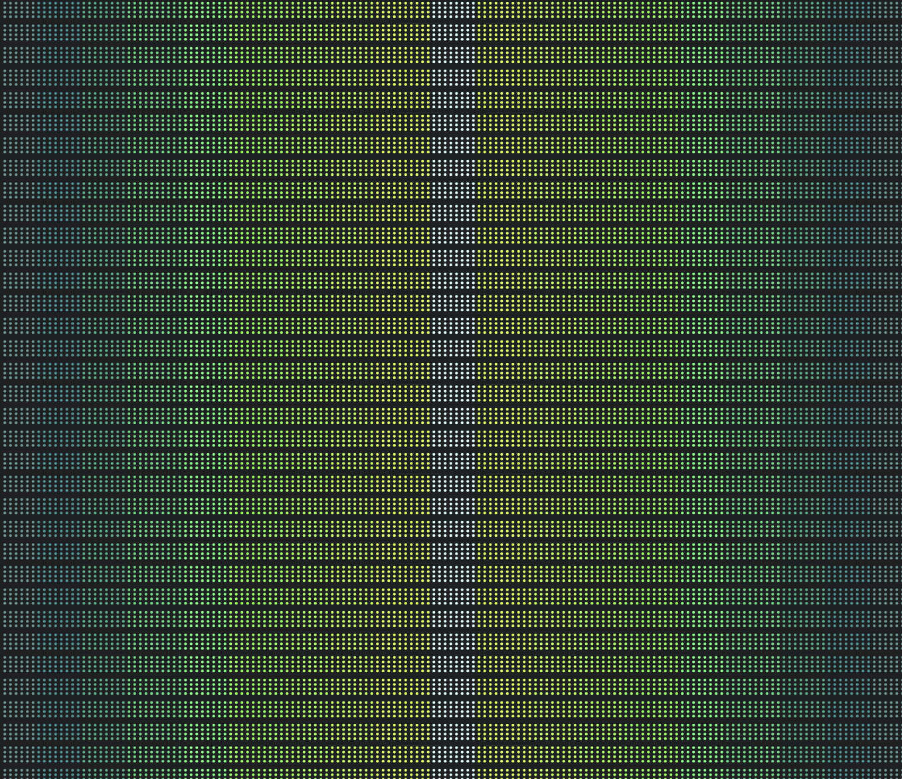

# nova

<p align="center">
  
</p>

A music visualizer for [cliamp](https://cliamp.stream) that turns your terminal
into a living wall of light.

**What makes nova different:** instead of bouncing bars or scrolling waveforms,
nova maps the 10-band EQ into **concentric rings** radiating from the center of
your screen. Bass pulses from the middle. Treble shimmers at the edges. As the
music heats up, the rings don't just change color — the braille dots themselves
**thicken toward center**, gaining mass on the beat and melting away slowly
after, like phosphor burning into a CRT.

It needs no art files, no setup, no config. Install it, press `v` until you
reach nova, and play something.

---

## Install

```bash
cliamp plugins install 8bit64k/cliamp-plugin-nova
```

Restart cliamp, press `v` to cycle visualizers until nova appears.

---

## Color Themes

Seven themes, each an 11-stop ANSI 256 glow ramp with a 4-stop overdrive ramp.

| [aurora](assets/aurora-theme-colors.png) | [amber](assets/amber-theme-colors.png) | [crt](assets/crt-theme-colors.png) | [whitehot](assets/whitehot-theme-colors.png) |
|:---:|:---:|:---:|:---:|
|  |  |  |  |
| Teal → cyan → green | Amber → gold → yellow | Green phosphor | Black → pure white |

| [blackhot](assets/blackhot-theme-colors.png) | [predator](assets/predator-theme-colors.png) | [terminal](assets/terminal-theme-colors.png) | |
|:---:|:---:|:---:|:---:|
|  |  |  | |
| White → black (inverted) | Thermal: blue → yellow → red | cliamp spectrum: green → yellow → red | |

---

## Ring Shapes

Three shapes, each a pure distance metric. `ring_shape = "cycle"` auto-rotates
through all three.

<p align="center">
  
  
  
  <br><em>circle &nbsp;&nbsp;&nbsp;&nbsp;&nbsp;&nbsp;&nbsp;&nbsp;&nbsp;&nbsp;&nbsp;&nbsp;&nbsp;&nbsp;&nbsp;&nbsp;&nbsp;&nbsp; diamond &nbsp;&nbsp;&nbsp;&nbsp;&nbsp;&nbsp;&nbsp;&nbsp;&nbsp;&nbsp;&nbsp;&nbsp;&nbsp;&nbsp;&nbsp;&nbsp;&nbsp;&nbsp; wings</em>
</p>

---

## Quick config

Everything is optional. With no config at all, nova renders in aurora + circle
with smooth ring blending and dot bloom. Add a `[plugins.nova]` block to
`~/.config/cliamp/config.toml`:

```toml
[plugins.nova]

# --- look ---
theme = "aurora"
#   amber | crt | whitehot | blackhot | aurora | predator | terminal
ring_shape = "circle"
#   circle | diamond | wings | cycle
ring_blend = true

# --- feel ---
preset = "default"
#   default | punch | ethereal | plasma | ghost | classic
cycle_presets = false

# --- bloom (glyph density) ---
bloom = true

# --- dynamics ---
attack = 0.55
release = 0.18
overdrive = 0.78
sustain = 0.82
blend = true
gate = 0.0
ceiling = 1.0

# --- performance ---
render_rate = 1.0
```

The full config surface with every knob, the Visual Dynamics preset table, and
the audio signal chain is documented in [docs/DESIGN.md](docs/DESIGN.md).

All theme + shape screenshots: [assets/](assets/)

---

## Tips

- Press **Shift+V** in cliamp for fullscreen — nova shines when it fills the terminal.
- Set `ring_shape = "cycle"` to preview all three shapes hands-free.
- Set `cycle_presets = true` to rotate through all six presets.
- For subtle density animation with barely any color, try `gate = 0.03, ceiling = 0.20`.
- For a CRT-era hard-edged look: `preset = "ghost"` with `ring_blend = false`.

---

## Troubleshooting

If nova shows a blank pane:

```bash
tail -n 40 ~/.config/cliamp/plugins.log
```

---

License: MIT © 8bit64k